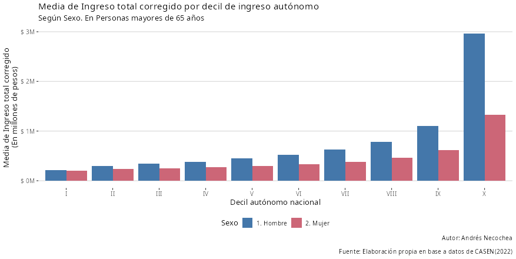

# Pobreza Ingresos Casen

Shiny App para explorar datos sobre pobreza y distribución de ingresos en la encuesta CASEN de forma interactiva.

Para ver el resultado final se puede usar el siguiente link: <https://andresnecochea.shinyapps.io/pobreza_ingresos_casen/>

Considerar que es una cuenta gratuita, la app sólo estará disponible por 25 horas activas al mes. Se recomienda descargar el script original desde github.

# Sobre encuesta CASEN

La encuesta CASEN es llevada a cabo por el ministerio de desarrollo social.

Los datos son públicos y se encuentran disponibles para descarga en el siguiente link: <https://observatorio.ministeriodesarrollosocial.gob.cl/encuesta-casen>

# Instrucciones generales

Se debe seguir una serie de pasos para que la app funcione correctamente.

-   Para la configuración automática de la app se necesita instalar los paquetes `svDialogs` y `ConfigParser`, antes de correr la app. En la consola ejecutar:

    `install.packages("svDialogs")`

    `install.packages("ConfigParser")`

-   Para descargar la encuesta CASEN y configurar la app se debe ejecutar el script: `inicio.R`.

El script `inicio.R` se encargará de descargar la base de datos, iniciar el procesamiento y correr la app.

-   Si deseas procesar los datos nuevamentes hay que correr el script `procesamiento.R`.

-   Para correr la app sin volver a procesar los datos ejecutar `pobreza_ingresos_casen/app.R`.

# Ejemplos

Con esta app se podrá explorar interactivamente algunas variables seleccionadas de la encuesta CASEN. El gráfico mostrará la media de ingresos según decil de ingreso autónomo nacional. Se podrá seleccionar diferentes variables de ingreso, incluyendo ingreso autónomo, monetario, total y per cápita del hogar.

A continuación se muestra algunos ejemplos. En primer lugar se muestra la media de ingreso del trabajo según decil de ingreso y sexo.

En el segundo gráfico se muestra la media de ingreso total según decil de ingreso y sexo en mayores de 65 años.

